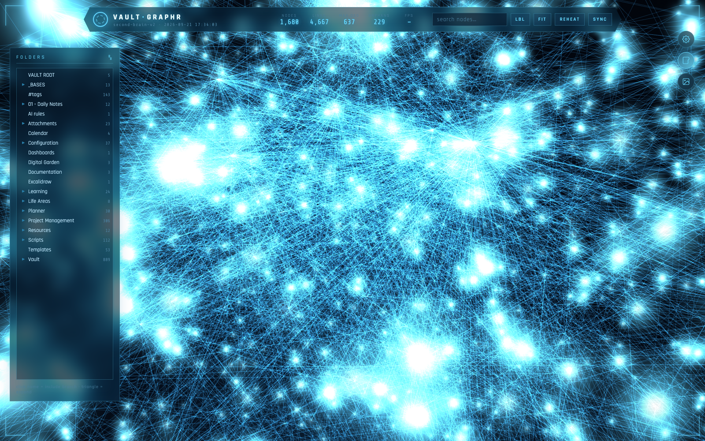

# vault-graph

A 3D force-directed graph of your Obsidian vault, served as a local web app with a sci-fi HUD aesthetic. Pure Python stdlib + vanilla Three.js — no dependencies, no build step.



## What it does

- **3D graph of your vault** — every note is a node, wikilinks are edges. Tag nodes (`#tag`) are synthesized and linked to their carriers, so tag clusters appear like in Obsidian's graph view.
- **Live physics tuning** — center force, repulsion, link force, link distance; Obsidian-style ranges. Layout re-energizes while you drag sliders and settles after release. Saved settings survive refreshes and follow you across devices (server-side defaults).
- **Groups (colors)** — define `tag:#MoC`, `path:Templates`, or `prop:value` groups; member nodes get the group color. Per-group color via a custom HSV picker (press-and-hold draggable). Groups only recolor — they never create nodes or links.
- **Filters** — Existing files only / Show orphans toggles, folder tree selection, fuzzy search, depth-of-connection focus.
- **Hover / selection focus** — hovering lights a node's first-degree connections and dims the rest; clicking makes it sticky until you click the background. Labels follow the focus: the selected node and all its neighbors always get labels.
- **Hide nodes** — a checkbox in the inspector removes a node *and its forces* from the simulation, so hiding a mega-hub (like an index note) lets clusters form without its pull.
- **Multi-window notes** — open any number of note windows; each is draggable, resizable, with an EDIT mode that autosaves back to the vault file (debounced), and clickable `[[wikilinks]]` that focus the target node in the graph and open it in Inspect. Broken links render dotted and dimmed.
- **Jarvis HUD styling** — glass panels, corner brackets, Rajdhani/Share Tech Mono, cyan-on-dark. Labels are world-anchored sprites; adaptive labeling (all nodes labeled on small graphs, top ~8% by degree on large ones, hard cap 60).

## Requirements

- Python 3.9+ (stdlib only — no `pip install` needed)
- A modern browser (Chrome/Edge/Safari/Firefox)

## Quick start

```bash
git clone https://github.com/arozwalak/vault-graph.git
cd vault-graph

# configure
cp .env.example .env
# edit .env → point VAULT_GRAPH_VAULT at your vault

python3 server.py
```

Then open **http://localhost:8777** — or, since the server binds to `0.0.0.0` by default, the same UI from your phone at `http://<your-mac-ip>:8777`.

## Configuration (`.env`)

| Variable | Default | Meaning |
|---|---|---|
| `VAULT_GRAPH_VAULT` | — (required) | Path to your Obsidian vault (folder containing `.obsidian`). `~` is expanded. |
| `VAULT_GRAPH_HOST` | `0.0.0.0` | Bind address. Use `127.0.0.1` to keep it local-only. |
| `VAULT_GRAPH_PORT` | `8777` | Port for the HTTP server. |

Environment variables also work directly (`VAULT_GRAPH_VAULT=... python3 server.py`); a `.env` file in the project root (or its parent) is loaded automatically if present.

## API

| Endpoint | Method | Purpose |
|---|---|---|
| `/graph.json` | GET | Full graph: nodes (notes, tags, attachments), links, folders. |
| `/api/note?f=<relpath>` | GET | Raw markdown of one note (path-guarded to the vault). |
| `/api/note` | POST | Save note content `{f, content}` (same guard, 300 KB cap). |
| `/api/defaults` | GET/POST | Server-side saved physics/display settings. |
| `/api/refresh` | POST | Force a re-scan of the vault. |

## Notes & limits

- Tags inside code blocks are ignored; frontmatter `tags:` (inline or YAML list, quoted or not) and inline `#tags` are recognized.
- Attachments (PDFs, images referenced by notes) appear as smaller nodes.
- Node positions are computed client-side; your layout is per-browser and persists in `localStorage`.
- The vault is only read for the graph; note *writes* happen only through the EDIT endpoint above, guarded to `.md` files inside the vault.

## License

MIT — see [LICENSE](LICENSE).